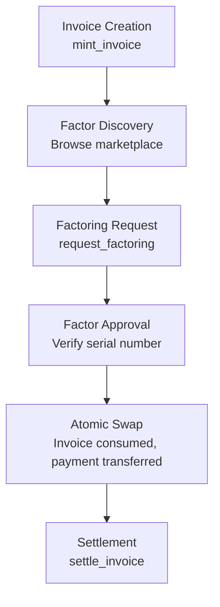
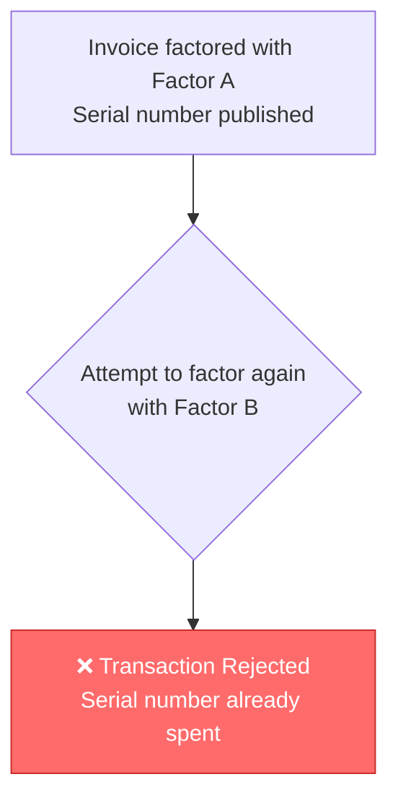
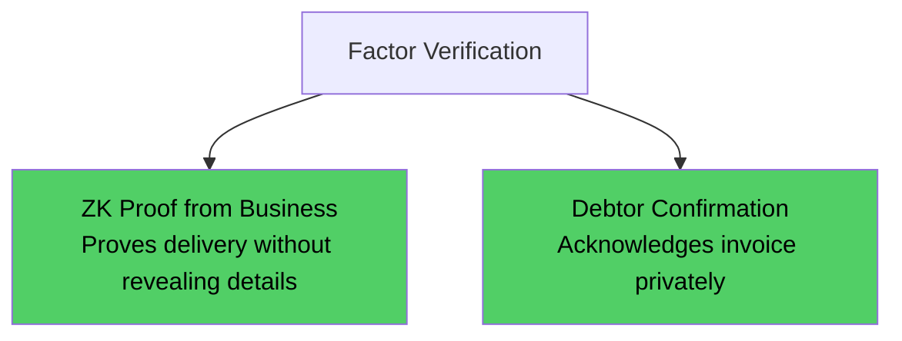

## Table of Contents

- [What is Invoice Factoring?](#what-is-invoice-factoring)
- [What is Double-Factoring Fraud?](#what-is-double-factoring-fraud)
- [Why Aleo is Perfect for This](#why-aleo-is-perfect-for-this)
- [Target Audience](#target-audience)
- [Pain Points by User Type](#pain-points-by-user-type)
- [MVP Features](#mvp-features)
- [User Flows](#user-flows)
- [Revenue Model Ideas](#revenue-model-ideas)

## What is Invoice Factoring?

Invoice factoring is when a business **sells its unpaid invoices** to a third party (the "factor") at a discount to get immediate cash instead of waiting 30-90 days for customers to pay.

**Example flow:**

1. Supplier delivers $100,000 of goods to Retailer
2. Retailer issues invoice with 60-day payment terms
3. Supplier needs cash now → sells invoice to Factor for $95,000 (5% discount)
4. Factor collects $100,000 from Retailer after 60 days → keeps $5,000 profit

## What is Double-Factoring Fraud?

Double Factoring Fraud occurs when a company sells the same invoice to more than one factoring company. When the debtor pays the invoice, only one factoring company will receive the payment, leaving the others at a loss.

**How it works:**

1. Supplier creates Invoice #1234 for $100,000
2. Sells it to Factor A for $95,000 ✓
3. Sells the **same invoice** to Factor B for $95,000 ✓
4. Sells it again to Factor C for $95,000 ✓
5. Retailer pays $100,000 → only ONE factor gets paid
6. Two factors lose $95,000 each

Industry reports indicate that up to 15% of submitted invoices may contain errors or fraudulent elements, and factoring firms can face losses of millions annually if fraud goes undetected.

**Current "solutions" are inadequate:** Establishing a centralized, real-time database to record and track the status of receivables can help prevent duplicate financing. This allows financiers to check whether a receivable has already been financed before approving a transaction.

But these databases are:

- Siloed (factors don't share data with competitors)
- Require trust in central operator
- Not real-time
- Privacy-compromising (reveals business relationships)

## Why Aleo is Perfect for This

**The killer insight:** When a business factors an invoice on Aleo, the invoice record is **consumed**. It literally cannot be double-factored because:

1. Invoice exists as a private record
2. Factoring transaction consumes the record (publishes serial number)
3. Attempting to factor again → serial number already spent → **transaction fails**

No central database needed. No trust required. Cryptographically impossible to double-factor.

## Target Audience

|Segment|Pain Points|
|---|---|
|**Small/Medium Enterprises (SMEs)**|Cash flow gaps, rejected by banks, long payment cycles|
|**Factoring Companies**|Fraud losses, verification costs, competitive data sharing|
|**International Traders**|Cross-border verification, currency risk, trust issues|
|**Manufacturing/Logistics**|60-90 day payment terms, seasonal cash needs|

**Primary users:**

1. **SME Business Owners** — Want fast cash, hate paperwork, value privacy
2. **Factor Operations Teams** — Need fraud prevention, fast verification
3. **Corporate Treasury** — Managing receivables across multiple factors

## Pain Points by User Type

### For Businesses Seeking Financing:

- **Privacy exposure**: Current factoring reveals customer relationships to factors
- **Slow approval**: Manual verification takes days
- **High fees**: Fraud risk priced into discount rates (typically 1-5%)
- **Relationship damage**: Customers learn you're factoring (sign of distress)

### For Factoring Companies:

- Fraud undermines trust between businesses, financiers, and other stakeholders. It creates uncertainty and discourages participation in the factoring market.
- Resolving disputes can involve lengthy and costly legal battles, further straining resources and damaging reputations.
- No way to verify if invoice was already factored elsewhere
- Manual debtor verification is expensive

### For the Ecosystem:

- The lack of preventive mechanisms incentivizes fraudulent behavior, leading to a higher overall risk profile for the industry.

## MVP Features

### Must Have (Wave 1-2):

|Feature|Description|Aleo Implementation|
|---|---|---|
|**Invoice Registration**|Business creates invoice record|`mint_invoice()` → private `Invoice` record|
|**Factor Verification**|Factor checks invoice not already sold|Query serial number registry (fails if exists)|
|**Factoring Transaction**|Business sells invoice to factor|`factor_invoice()` consumes Invoice, mints `FactoredInvoice` to factor|
|**Anti-Double-Factor**|Cryptographic guarantee|Serial number published on-chain = spent|
|**Payment Settlement**|Debtor pays, factor receives|`settle_invoice()` releases escrowed funds|

### Should Have (Wave 3-4):

|Feature|Description|
|---|---|
|**USDCx Payment Integration**|Accept and settle payments in USDCx stablecoin|
|**Partial Factoring**|Sell 50% of invoice, keep 50%|
|**Recourse Tracking**|If debtor doesn't pay, track return to business|
|**Multi-Factor Syndication**|Large invoices split across multiple factors|
|**Credit Scoring**|ZK proof of payment history without revealing details|

### Nice to Have (Wave 5+):

|Feature|Description|
|---|---|
|**Cross-border Factoring**|Multi-currency support|
|**Supply Chain Integration**|Auto-generate invoices from delivery confirmation|
|**Debtor Notification**|Privacy-preserving payment instructions|

## User Flows

### Flow 1: Business Factors an Invoice

### Flow 2: Attempted Double-Factoring (BLOCKED)

**No central database. No trust. Cryptographically impossible.**

### Flow 3: Factor Verifies Invoice Authenticity

