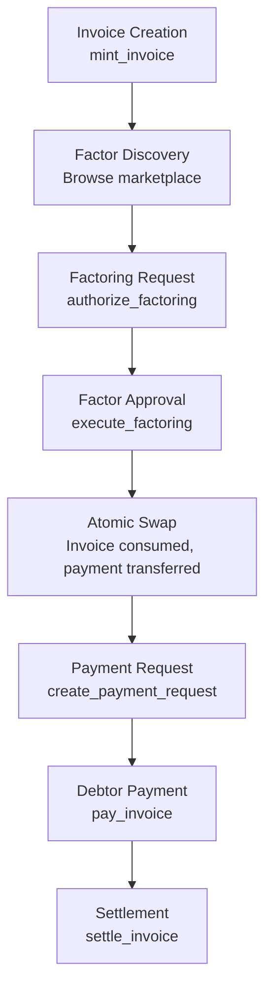
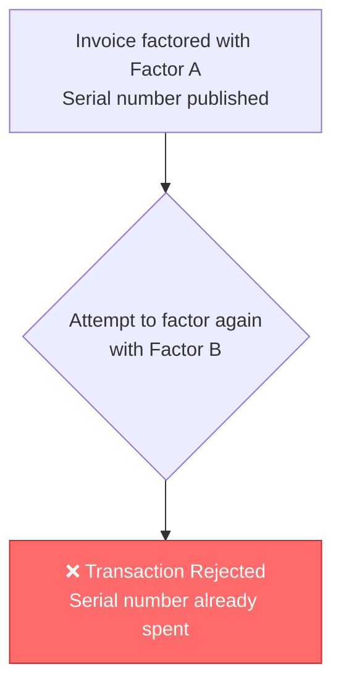
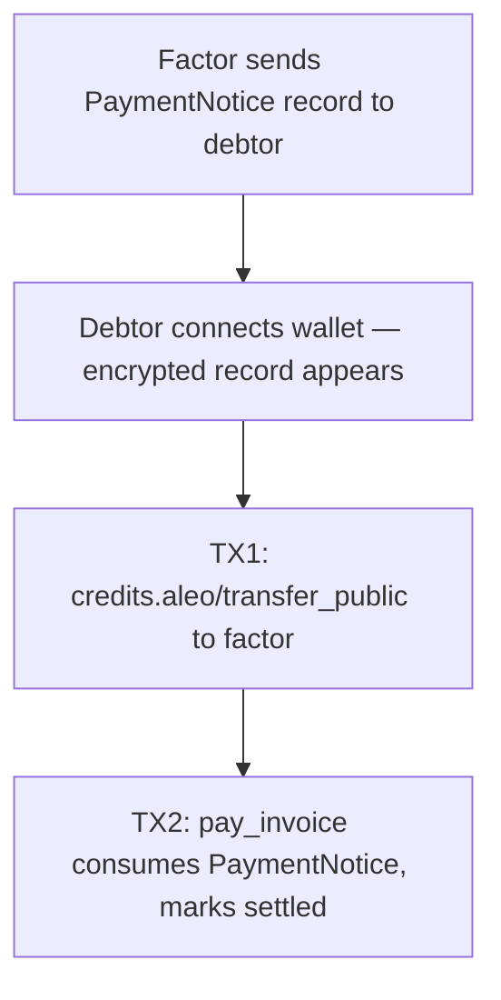

# Product Requirements Document

## Table of Contents

- [What is ZK Factor?](#what-is-zk-factor)
- [What is Invoice Factoring?](#what-is-invoice-factoring)
- [What is Double-Factoring Fraud?](#what-is-double-factoring-fraud)
- [Why Aleo is Perfect for This](#why-aleo-is-perfect-for-this)
- [Target Audience](#target-audience)
- [Pain Points by User Type](#pain-points-by-user-type)
- [MVP Features](#mvp-features)
- [User Flows](#user-flows)
- [How We Built It](#how-we-built-it)
- [What We Learned](#what-we-learned)
- [Revenue Model Ideas](#revenue-model-ideas)

## What is ZK Factor?

ZK Factor is a privacy-preserving invoice factoring platform built on Aleo blockchain. It cryptographically prevents double-factoring fraud while keeping invoice amounts, business relationships, and transaction details completely private. Businesses mint invoice records, factors purchase them through atomic swaps, and the UTXO consumption model makes re-factoring the same invoice mathematically impossible.

## What is Invoice Factoring?

Invoice factoring is when a business **sells its unpaid invoices** to a third party (the "factor") at a discount to get immediate cash instead of waiting 30-90 days for customers to pay.

**Example flow:**

1. Supplier delivers $100,000 of goods to Retailer
2. Retailer issues invoice with 60-day payment terms
3. Supplier needs cash now → sells invoice to Factor for $95,000 (5% discount)
4. Factor collects $100,000 from Retailer after 60 days → keeps $5,000 profit

## What is Double-Factoring Fraud?

Double Factoring Fraud occurs when a company sells the same invoice to more than one factoring company. When the debtor pays the invoice, only one factoring company will receive the payment, leaving the others at a loss.

**How it works:**

1. Supplier creates Invoice #1234 for $100,000
2. Sells it to Factor A for $95,000 ✓
3. Sells the **same invoice** to Factor B for $95,000 ✓
4. Sells it again to Factor C for $95,000 ✓
5. Retailer pays $100,000 → only ONE factor gets paid
6. Two factors lose $95,000 each

Industry reports indicate that up to 15% of submitted invoices may contain errors or fraudulent elements, and factoring firms can face losses of millions annually if fraud goes undetected. The [$2.3 billion First Brands Group case](https://www.funderintel.com/post/the-2-3-billion-vanishing-act-first-brands-and-the-factoring-fraud-that-shocked-wall-street) is under DOJ investigation as of 2025.

**Current "solutions" are inadequate:**

- Siloed (factors don't share data with competitors)
- Require trust in central operator
- Not real-time
- Privacy-compromising (reveals business relationships)

## Why Aleo is Perfect for This

**The killer insight:** When a business factors an invoice on Aleo, the invoice record is **consumed**. It literally cannot be double-factored because:

1. Invoice exists as a private record
2. Factoring transaction consumes the record (publishes serial number)
3. Attempting to factor again → serial number already spent → **transaction fails**

No central database needed. No trust required. Cryptographically impossible to double-factor.

## Target Audience

| Segment                             | Pain Points                                                |
| ----------------------------------- | ---------------------------------------------------------- |
| **Small/Medium Enterprises (SMEs)** | Cash flow gaps, rejected by banks, long payment cycles     |
| **Factoring Companies**             | Fraud losses, verification costs, competitive data sharing |
| **International Traders**           | Cross-border verification, currency risk, trust issues     |
| **Manufacturing/Logistics**         | 60-90 day payment terms, seasonal cash needs               |

**Primary users:**

1. **SME Business Owners** — Want fast cash, hate paperwork, value privacy
2. **Factor Operations Teams** — Need fraud prevention, fast verification
3. **Corporate Treasury** — Managing receivables across multiple factors

## Pain Points by User Type

### For Businesses Seeking Financing:

- **Privacy exposure**: Current factoring reveals customer relationships to factors
- **Slow approval**: Manual verification takes days
- **High fees**: Fraud risk priced into discount rates (typically 1-5%)
- **Relationship damage**: Customers learn you're factoring (sign of distress)

### For Factoring Companies:

- Fraud undermines trust between businesses, financiers, and other stakeholders
- Resolving disputes can involve lengthy and costly legal battles
- No way to verify if invoice was already factored elsewhere
- Manual debtor verification is expensive

### For the Ecosystem:

- The lack of preventive mechanisms incentivizes fraudulent behavior, leading to a higher overall risk profile for the industry

## MVP Features

### Must Have (Wave 1-2):

| Feature                   | Description                            | Aleo Implementation                                                    |
| ------------------------- | -------------------------------------- | ---------------------------------------------------------------------- |
| **Invoice Registration**  | Business creates invoice record        | `mint_invoice()` → private `Invoice` record                            |
| **Factor Verification**   | Factor checks invoice not already sold | Query serial number registry (fails if exists)                         |
| **Factoring Transaction** | Business sells invoice to factor       | `factor_invoice()` consumes Invoice, mints `FactoredInvoice` to factor |
| **Anti-Double-Factor**    | Cryptographic guarantee                | Serial number published on-chain = spent                               |
| **Payment Settlement**    | Debtor pays, factor receives           | `settle_invoice()` releases escrowed funds                             |

### Should Have (Wave 3-4):

| Feature                            | Description                                           |
| ---------------------------------- | ----------------------------------------------------- |
| **Stablecoin Payment Integration** | Accept and settle payments in USDCx stablecoin        |
| **Partial Factoring**              | Sell 50% of invoice, keep 50%                         |
| **Recourse Tracking**              | If debtor doesn't pay, track return to business       |
| **Multi-Factor Syndication**       | Large invoices split across multiple factors via ownerless pools (`create_ownerless_pool()`, `pool_contribute()`, `execute_approved_pool()`) |
| **Credit Scoring**                 | ZK proof of payment history without revealing details |

### Nice to Have (Wave 5+):

| Feature                      | Description                                       |
| ---------------------------- | ------------------------------------------------- |
| **Cross-border Factoring**   | Multi-currency support                            |
| **Supply Chain Integration** | Auto-generate invoices from delivery confirmation |
| **Debtor Notification**      | Privacy-preserving payment instructions           |

## User Flows

### Flow 1: Business Factors an Invoice

```mermaid
flowchart TD
    A[Invoice Creation<br/>mint_invoice]
    B[Factor Discovery<br/>Browse marketplace]
    C[Factoring Request<br/>authorize_factoring]
    D[Factor Approval<br/>execute_factoring]
    E[Atomic Swap<br/>Invoice consumed, payment transferred]
    F[Payment Request<br/>create_payment_request]
    G[Debtor Payment<br/>pay_invoice]
    H[Settlement<br/>settle_invoice]

    A --> B --> C --> D --> E --> F --> G --> H
```

### Flow 2: Attempted Double-Factoring (BLOCKED)

```mermaid
flowchart TD
    A[Invoice factored with Factor A<br/>Serial number published]
    B{Attempt to factor again<br/>with Factor B}
    C[❌ Transaction Rejected<br/>Serial number already spent]

    A --> B --> C

    style C fill:#ff6b6b,stroke:#c92a2a,color:#fff
```

**No central database. No trust. Cryptographically impossible.**

### Flow 3: Debtor Payment Flow (Private)

```mermaid
flowchart TD
    A[Factor sends PaymentNotice record to debtor]
    B[Debtor connects wallet — encrypted record appears]
    C[TX1: credits.aleo/transfer_public to factor]
    D[TX2: pay_invoice consumes PaymentNotice, marks settled]

    A --> B --> C --> D
```

The PaymentNotice record is encrypted with the debtor's public key — nothing is readable on-chain. Only the debtor's wallet can decrypt it.

## How We Built It

Designed a UTXO-based record model where Invoice records are consumed during factoring, publishing serial numbers that prevent reuse.

Implemented core Leo transitions:

- `mint_invoice()` creates encrypted invoice records
- `authorize_factoring()` consumes Invoice → FactoringOffer to factor
- `execute_factoring()` atomically swaps FactoringOffer for payment while transferring advance to business
- `create_payment_request()` sends private PaymentNotice record to debtor (nothing public)
- `pay_invoice()` consumes PaymentNotice and marks invoice settled on-chain
- `settle_invoice()` allows factor to finalize after debtor payment

Used public mappings for factor registration (`active_factors`), settlement tracking (`settled_invoices`), and ownerless pool state (`pool_meta`, `pool_contributions`, `pool_votes`) while keeping all sensitive data in encrypted records.

Multi-factor syndication uses an ownerless pool model: pools are stored in public on-chain mappings (globally discoverable), factors contribute credits to program escrow, vote to approve pending offers, and claim proportional proceeds after settlement — no single pool owner required.

Built React frontend with Shield Wallet integration, proof generation progress tracking, and asynchronous record discovery.

**Technologies:**

- Aleo blockchain
- Leo programming language
- React + TypeScript with `@provablehq/sdk`
- Shield Wallet integration
- zkSNARKs, Poseidon hashing
- Record encryption, zero-knowledge proofs, on-chain commitments

## What We Learned

The UTXO model requires fundamentally different architectural thinking than account-based systems. Zero-knowledge proofs provide genuine cryptographic confidentiality but introduce latency that challenges traditional UX expectations.

Key lessons:

- **Record discovery limitations** force careful consideration of wallet synchronization flows
- **Async design isn't optional** when proving may take minutes
- **Shield Wallet cannot handle cross-program calls** in a single transaction — this required splitting the debtor payment into two sequential transactions
- **Private records are powerful** — the PaymentNotice pattern eliminates the need for any public mapping to coordinate debtor payment
- **Blockchain privacy requires thinking beyond cryptography** to include network metadata, timing analysis, and operational security

## Revenue Model Ideas

- **Protocol fee**: 0.3-0.7% of factored amount collected automatically via smart contract
- **Factor subscriptions**: Monthly fee for unlimited verifications + premium analytics
- **ZK credit scoring**: Fee-based proof generation for payment history
- **White-label licensing**: Private instance deployments for banks and fintechs
