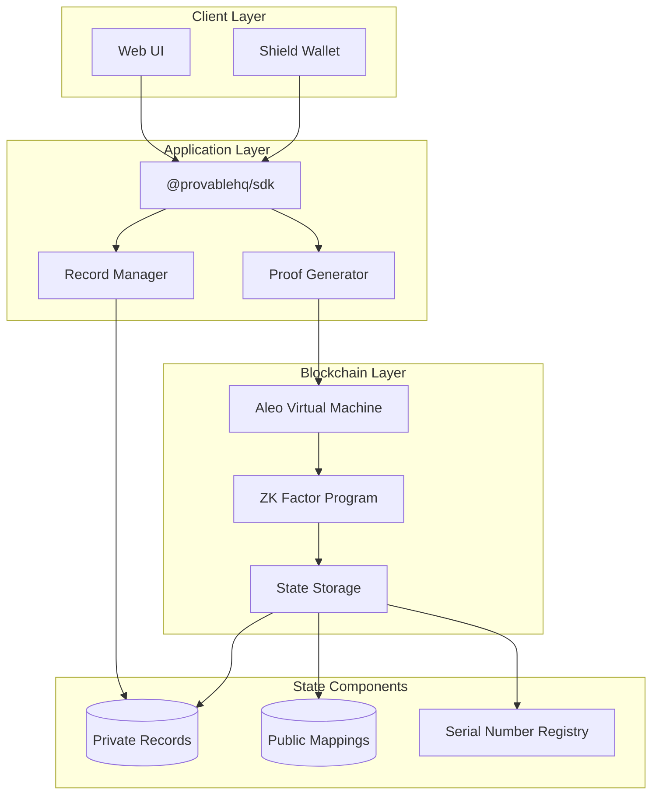
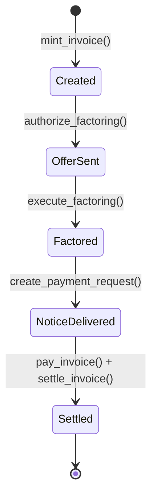
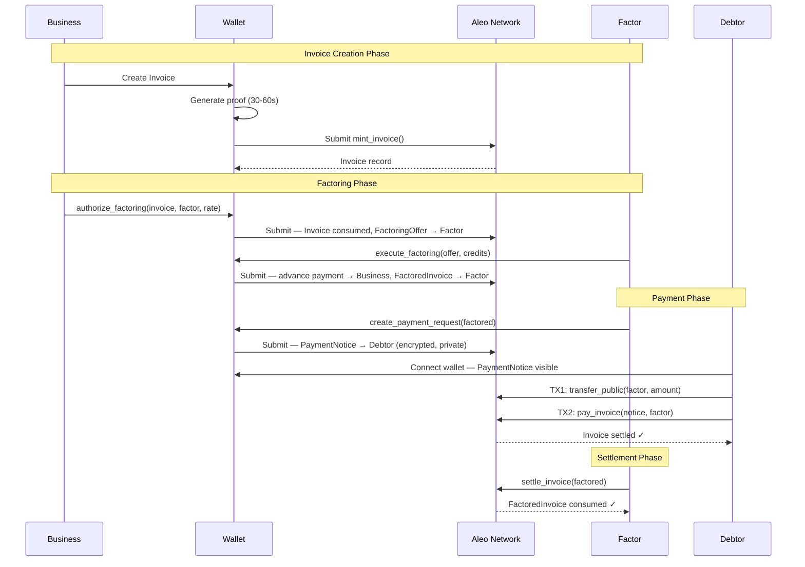
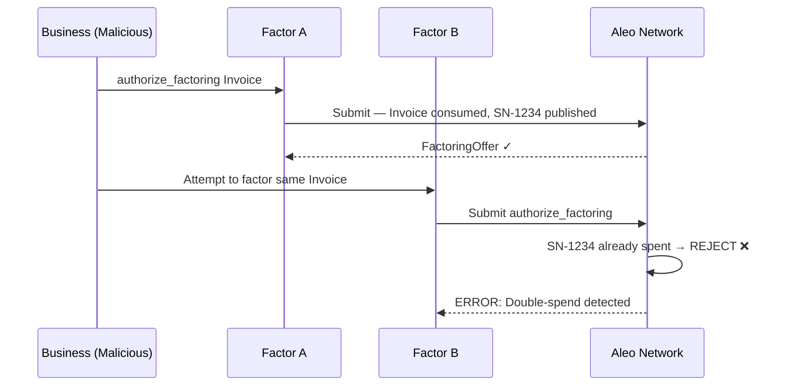

# Technical Specifications

## Table of Contents

- [System Overview](#system-overview)
- [Data Models](#data-models)
- [Program Transitions](#program-transitions)
- [System Sequences](#system-sequences)
- [Privacy Architecture](#privacy-architecture)
- [API Specifications](#api-specifications)
- [Security Specifications](#security-specifications)
- [Error Handling](#error-handling)
- [Testing Specifications](#testing-specifications)
- [Maintenance & Operations](#maintenance--operations)
- [Constraints & Limitations](#constraints--limitations)
- [Appendices](#appendices)

## System Overview

### Purpose

ZK Factor is a privacy-preserving invoice factoring platform built on Aleo blockchain that cryptographically prevents double-factoring fraud while maintaining confidentiality of business relationships, invoice amounts, and transaction details.

### System Architecture


```mermaid
graph TB
    subgraph "Client Layer"
        UI[Web UI]
        Wallet[Shield Wallet]
    end

    subgraph "Application Layer"
        SDK["@provablehq/sdk"]
        ProofGen[Proof Generator]
        RecordMgr[Record Manager]
    end

    subgraph "Blockchain Layer"
        AleoVM[Aleo Virtual Machine]
        Program[ZK Factor Program]
        State[State Storage]
    end

    subgraph "State Components"
        Records[(Private Records)]
        Mappings[(Public Mappings)]
        SerialReg[Serial Number Registry]
    end

    UI --> SDK
    Wallet --> SDK
    SDK --> ProofGen
    SDK --> RecordMgr
    ProofGen --> AleoVM
    RecordMgr --> Records
    AleoVM --> Program
    Program --> State
    State --> Records
    State --> Mappings
    State --> SerialReg
```

### Technology Stack

| Layer          | Technology             |
| -------------- | ---------------------- |
| Blockchain     | Aleo Testnet / Mainnet |
| Smart Contract | Leo                    |
| SDK            | @provablehq/sdk        |
| Frontend       | React + TypeScript     |
| Wallet         | Shield Wallet          |
| Proving        | WASM-based (browser)   |
| Hashing        | Poseidon2              |
| Proofs         | zkSNARKs               |

## Data Models

### Record Structures

#### Invoice Record

```leo
record Invoice {
    owner: address,         // Business that created invoice
    debtor: address,        // Customer who owes payment
    amount: u64,            // Amount in microcredits
    due_date: u64,          // Unix timestamp (seconds)
    invoice_hash: field,    // Poseidon hash of invoice details
    nonce: field,           // Unique identifier
    metadata: u128          // Packed metadata (invoice #, type, flags)
}
```

#### FactoredInvoice Record

```leo
record FactoredInvoice {
    owner: address,              // Factor who purchased invoice
    original_creditor: address,  // Business that created invoice
    debtor: address,             // Customer who owes payment
    amount: u64,                 // Original invoice amount
    advance_amount: u64,         // Amount paid to business (< amount)
    due_date: u64,               // Original due date
    factoring_date: u64,         // When factoring occurred
    advance_rate: u16,           // Basis points (e.g., 9500 = 95%)
    invoice_hash: field,         // Links to original invoice
    recourse: bool               // True if recourse factoring
}
```

#### FactoringOffer Record

```leo
record FactoringOffer {
    owner: address,              // Factor
    original_creditor: address,  // Business that created the original invoice
    debtor: address,             // Customer who owes payment
    amount: u64,                 // Full invoice amount in microcredits
    due_date: u64,               // Original invoice due date (Unix timestamp)
    advance_rate: u16,           // Agreed rate in basis points (e.g. 9500 = 95%)
    invoice_hash: field,         // Links back to the original off-chain invoice
    nonce: field,                // Carried over from Invoice for record uniqueness
    metadata: u128               // Carried over from Invoice
}
```

#### PaymentNotice Record

```leo
// Private record sent to debtor — only their wallet can read it
// No public data exposed on-chain
record PaymentNotice {
    owner: address,    // debtor
    factor: address,
    amount: u64,
    due_date: u64,
    invoice_hash: field,
}
```

**Privacy model:** PaymentNotice is encrypted with the debtor's public key. Nothing about the payment request is readable on-chain. The debtor sees it only in their own wallet after scanning.

### Public Mappings

```leo
// Track registered factoring companies
mapping active_factors: address => FactorInfo;

// Track settlement status (prevents double settlement)
mapping settled_invoices: field => SettlementInfo;

// Protocol statistics (public analytics)
mapping protocol_stats: u8 => u64;
// Keys: 1=total_factored, 2=total_settled
```

```leo
struct FactorInfo {
    is_active: bool,
    min_advance_rate: u16,
    max_advance_rate: u16,
    total_factored: u64,
    registration_date: u64,
}

struct SettlementInfo {
    is_settled: bool,
    settlement_date: u64,
    factor: address,
}
```

---

## Program Transitions

### Invoice Lifecycle State Machine


```mermaid
stateDiagram-v2
    [*] --> Created: mint_invoice()
    Created --> OfferSent: authorize_factoring()
    OfferSent --> Factored: execute_factoring()
    Factored --> NoticeDelivered: create_payment_request()
    NoticeDelivered --> Settled: pay_invoice() + settle_invoice()
    Settled --> [*]
```

### Transition Specifications

#### mint_invoice

**Signature:**

```leo
async transition mint_invoice(
    debtor: address,
    amount: u64,
    due_date: u64,
    invoice_hash: field,
    metadata: u128
) -> (Invoice, Future)
```

**Preconditions:**

- `amount > 0`
- `due_date > block.timestamp`
- `debtor != self.caller`

**Postconditions:**

- Returns new Invoice record owned by caller
- No state mappings modified

#### authorize_factoring

**Signature:**

```leo
async transition authorize_factoring(
    invoice: Invoice,
    factor: address,
    advance_rate: u16,
) -> (FactoringOffer, Future)
```

**Preconditions:**

- `invoice.owner == self.caller`
- `advance_rate >= 5000u16 && advance_rate <= 9900u16`
- Factor must be registered and active in `active_factors`

**Postconditions:**

- Invoice record consumed (serial number published — cannot be double-factored)
- FactoringOffer record created, owned by factor

**Anti-double-factor guarantee:** Invoice consumption happens atomically. If the same Invoice is submitted a second time, the serial number is already spent and the transaction fails at the protocol level.

#### execute_factoring

**Signature:**

```leo
async transition execute_factoring(
    offer: FactoringOffer,
    payment: credits.aleo/credits,
) -> (FactoredInvoice, credits.aleo/credits, credits.aleo/credits, Future)
```

**Preconditions:**

- `offer.owner == self.caller` (only the factor can execute)
- `payment.microcredits >= advance_amount`
- Factor still active at execution time

**Postconditions:**

- FactoringOffer consumed
- FactoredInvoice created, owned by factor
- Advance payment transferred to business via `credits.aleo/transfer_private`
- Change returned to factor

**Note:** Shield Wallet cannot handle cross-program calls in a single transaction. The payment routing is handled entirely within this transition using `credits.aleo/transfer_private`.

#### create_payment_request

**Signature:**

```leo
transition create_payment_request(
    factored: FactoredInvoice,
) -> (FactoredInvoice, PaymentNotice)
```

**Preconditions:**

- `factored.owner == self.caller`

**Postconditions:**

- FactoredInvoice returned to factor (same record, reconstituted)
- PaymentNotice record created, owned by `factored.debtor`
- **Nothing is written to any public mapping — completely private**

**Privacy note:** This is a plain (non-async) transition. The PaymentNotice is an encrypted record on-chain that only the debtor's wallet can decrypt.

#### pay_invoice

**Signature:**

```leo
async transition pay_invoice(
    notice: PaymentNotice,
    factor: address,
) -> Future
```

**Preconditions:**

- `notice.owner == self.caller`
- `notice.factor == factor`
- Invoice not already settled

**Frontend two-transaction pattern (Shield Wallet limitation):**
The debtor executes two sequential transactions:

1. `credits.aleo/transfer_public(factor, amount)` — actual payment
2. `pay_invoice(notice, factor)` — consumes PaymentNotice, marks settled on-chain

**Postconditions:**

- PaymentNotice consumed
- `settled_invoices` mapping updated
- `protocol_stats` key 2 incremented

#### settle_invoice

**Signature:**

```leo
async transition settle_invoice(
    factored: FactoredInvoice,
) -> Future
```

**Preconditions:**

- `factored.owner == self.caller`
- Invoice not already settled

**Postconditions:**

- FactoredInvoice consumed
- `settled_invoices` mapping updated

---

## System Sequences

### Primary Factoring Flow


```mermaid
sequenceDiagram
    participant B as Business
    participant W as Wallet
    participant A as Aleo Network
    participant F as Factor
    participant D as Debtor

    Note over B,F: Invoice Creation Phase
    B->>W: Create Invoice
    W->>W: Generate proof (30-60s)
    W->>A: Submit mint_invoice()
    A-->>W: Invoice record

    Note over B,F: Factoring Phase
    B->>W: authorize_factoring(invoice, factor, rate)
    W->>A: Submit — Invoice consumed, FactoringOffer → Factor
    F->>W: execute_factoring(offer, credits)
    W->>A: Submit — advance payment → Business, FactoredInvoice → Factor

    Note over F,D: Payment Phase
    F->>W: create_payment_request(factored)
    W->>A: Submit — PaymentNotice → Debtor (encrypted, private)
    D->>W: Connect wallet — PaymentNotice visible
    D->>A: TX1: transfer_public(factor, amount)
    D->>A: TX2: pay_invoice(notice, factor)
    A-->>D: Invoice settled ✓

    Note over F: Settlement Phase
    F->>A: settle_invoice(factored)
    A-->>F: FactoredInvoice consumed ✓
```

### Double-Factoring Prevention Flow


```mermaid
sequenceDiagram
    participant B as Business (Malicious)
    participant FA as Factor A
    participant FB as Factor B
    participant A as Aleo Network

    B->>FA: authorize_factoring Invoice #1234
    FA->>A: Submit — Invoice consumed, SN-1234 published
    A-->>FA: FactoringOffer ✓

    B->>FB: Attempt to factor same Invoice #1234
    FB->>A: Submit authorize_factoring
    A->>A: SN-1234 already spent → REJECT ❌
    A-->>FB: ERROR: Double-spend detected
```

---

## Privacy Architecture

### Privacy Guarantees

| Data Element                             | Visibility             | Mechanism                             |
| ---------------------------------------- | ---------------------- | ------------------------------------- |
| Invoice amount                           | Business + Factor only | Record encryption (owner key)         |
| Debtor identity                          | Business + Factor only | Record encryption                     |
| Factoring terms                          | Business + Factor only | Record encryption                     |
| PaymentNotice (amount, factor, due date) | Debtor only            | Record encryption (debtor key)        |
| Goods/services                           | Business only          | Off-chain storage, hash only          |
| Serial numbers                           | Public                 | Required for double-spend prevention  |
| Function calls                           | Public                 | Aleo limitation (no function privacy) |
| Transaction timing                       | Public                 | Blockchain consensus requirement      |
| Settlement status                        | Public                 | `settled_invoices` mapping            |

**Key insight:** Before `create_payment_request`, nothing about an invoice is public. After `create_payment_request`, still nothing is public — the PaymentNotice is an encrypted private record. The old approach (public `payment_requests` mapping) permanently exposed amount, debtor address, factor address, and due date. The current approach exposes nothing.

## API Specifications

### SDK Integration Layer

```typescript
interface ZKFactorSDK {
  createInvoice(params: CreateInvoiceParams): Promise<InvoiceRecord>;
  getInvoices(owner: string): Promise<InvoiceRecord[]>;
  authorizeFactoring(
    invoice: InvoiceRecord,
    factor: string,
    advanceRate: number,
  ): Promise<FactoringOffer>;
  executeFactoring(
    offer: FactoringOffer,
    creditsRecord: CreditsRecord,
  ): Promise<FactoredInvoiceRecord>;
  createPaymentRequest(
    factored: FactoredInvoiceRecord,
  ): Promise<{ factored: FactoredInvoiceRecord; notice: PaymentNotice }>;
  payInvoice(notice: PaymentNotice, factor: string): Promise<Transaction>;
  settleInvoice(factored: FactoredInvoiceRecord): Promise<Transaction>;
  checkSettled(invoiceHash: string): Promise<boolean>;
}
```

## Security Specifications

### Smart Contract Security

**Critical Assertions:**

```leo
// Amount validation
assert(amount > 0u64);

// Date validation
assert(due_date > block.timestamp);

// Address validation
assert(debtor != self.caller);

// Rate validation
assert(advance_rate >= 5000u16 && advance_rate <= 9900u16);

// Payment validation
assert(payment.microcredits >= advance_amount);

// Safe multiplication with overflow prevention
let product: u128 = (offer.amount as u128) * (offer.advance_rate as u128);
let advance_amount: u64 = (product / 10000u128) as u64;
```

**Reentrancy Prevention:** Aleo's execution model prevents reentrancy by design — each transition is atomic and finalized before the next can begin.

### Access Control

**Role-Based Permissions:**

```leo
// Only invoice owner can authorize factoring
assert(invoice.owner == self.caller);

// Only registered, active factors can receive factored invoices
let factor_info: FactorInfo = Mapping::get(active_factors, factor);
assert(factor_info.is_active);

// Only factored invoice owner (factor) can request payment or settle
assert(factored.owner == self.caller);

// Only PaymentNotice owner (debtor) can pay
assert(notice.owner == self.caller);
assert(notice.factor == factor);
```

## Error Handling

### Common Error Scenarios

| Error                 | Description                         | Recovery                                     |
| --------------------- | ----------------------------------- | -------------------------------------------- |
| Double-spend          | Invoice already factored            | Inform user, block duplicate                 |
| Already settled       | Invoice already settled             | Show settled status                          |
| Factor not active     | Factor deregistered                 | Show error, re-select factor                 |
| Insufficient credits  | Not enough balance for advance      | Show required amount                         |
| Extension invalidated | Chrome killed wallet service worker | Hard refresh + reconnect                     |
| Program not allowed   | Wallet cached old whitelist         | Disconnect/reconnect wallet                  |
| Transaction rejected  | Wallet local simulation failed      | Check cross-program call, split into two txs |

### Shield Wallet Known Limitations

- **Cannot handle cross-program calls** in a single transaction — any call to `credits.aleo` from within `zk_factor.aleo` will be rejected
- **Solution**: Split into two sequential frontend transactions
- **"Extension context invalidated"** → Chrome killed extension service worker → hard refresh + reconnect
- **"WalletError: Program not allowed"** → wallet cached whitelist → disconnect/reconnect
- Factor needs private credits record for `execute_factoring` → use `transfer_public_to_private` if only public balance available

## Testing Specifications

### Test Cases

- ✅ Valid invoice creation
- ✅ Invalid amount (zero)
- ✅ Invalid due date (past)
- ✅ Valid factoring execution
- ✅ Double-factoring attempt (should fail)
- ✅ Invalid advance rate (too low, too high)
- ✅ Insufficient payment
- ✅ Valid payment notice delivery
- ✅ Valid debtor payment (two-tx flow)
- ✅ Double settlement attempt (should fail)
- ✅ Unregistered factor attempt (should fail)

### Full Integration Test Scenario

1. Business registers → `mint_invoice()` → Invoice record
2. Business → `authorize_factoring(invoice, factor, rate)` → FactoringOffer to factor (Invoice consumed)
3. Factor → `execute_factoring(offer, credits)` → FactoredInvoice + advance payment to business
4. Factor → `create_payment_request(factored)` → PaymentNotice to debtor (nothing public)
5. Debtor connects wallet → sees PaymentNotice
6. Debtor → TX1: `credits.aleo/transfer_public(factor, amount)` + TX2: `pay_invoice(notice, factor)`
7. Factor → `settle_invoice(factored)` → FactoredInvoice consumed, settled

## Maintenance & Operations

### Smart Contract Upgrade Procedure

ZK-Factor uses program versioning for upgrades (e.g., `zk_factor_12250.aleo`). Because constructor logic and record structures are immutable once deployed, breaking changes require a new program name.

**What Can Be Upgraded (same program name):**

- Function/transition logic (signatures unchanged)
- Gas optimizations
- New transitions, mappings, structs
- Protocol statistics improvements

**Cannot Be Modified (require new program):**

- Existing record structures
- Transition signatures
- Existing mapping key/value types
- The constructor

**Migration Strategy:**

1. Deploy `zk_factor_vN.aleo` with migration transitions
2. Users opt-in to migrate records
3. Previous program continues operating indefinitely
4. Factors support both programs during transition

### Backup & Recovery

- On-chain data is permanently stored on blockchain (no backup needed)
- Wallet recovery from seed phrase
- Record re-discovery through blockchain scan
- Transaction history reconstruction from blockchain

## Constraints & Limitations

### Aleo Platform Constraints

| Constraint           | Value                | Impact                                 |
| -------------------- | -------------------- | -------------------------------------- |
| Max transaction size | 128 KB               | Limits complex multi-record operations |
| Circuit constraints  | ~2M per transition   | Caps computational complexity          |
| Proving time         | 30-420 sec           | UX friction, requires async design     |
| Record discovery     | Full blockchain scan | Slow initial wallet sync (2-5 min)     |
| Function privacy     | Not implemented      | Function calls are public              |
| No SHA-2/RSA/ECDSA   | Native limitation    | Limits external integration            |

### MVP Limitations

**Phase 1 Scope Exclusions:**

- ❌ Partial factoring (split ownership)
- ❌ Multi-factor syndication
- ❌ Automated settlement triggers
- ❌ Credit scoring system
- ❌ Cross-border currency support
- ❌ Real-time price discovery

**Known UX Issues:**

- Wallet sync can take 2-5 minutes for new users (blockchain scanning)
- Proving times of 30-420 seconds require clear async feedback
- No offline proof generation capability
- Limited to browser-based execution (no mobile native)
- Two-transaction debtor payment flow (Shield Wallet cross-program limitation)

## Appendices

### Glossary

| Term          | Definition                                                      |
| ------------- | --------------------------------------------------------------- |
| Factor        | Financial institution that purchases invoices at discount       |
| Advance Rate  | Percentage of invoice value paid upfront (e.g., 95%)            |
| Recourse      | Agreement where business repurchases invoice if debtor defaults |
| Serial Number | Cryptographic commitment to record, published when spent        |
| Transition    | State-changing function in Leo program                          |
| Microcredits  | Smallest unit of ALEO token (1M microcredits = 1 ALEO)          |
| View Key      | Private key enabling read-only access to encrypted records      |
| zkSNARK       | Zero-Knowledge Succinct Non-Interactive Argument of Knowledge   |
| UTXO          | Unspent Transaction Output — records are consumed when used     |
| PaymentNotice | Private record owned by debtor, visible only in their wallet    |
