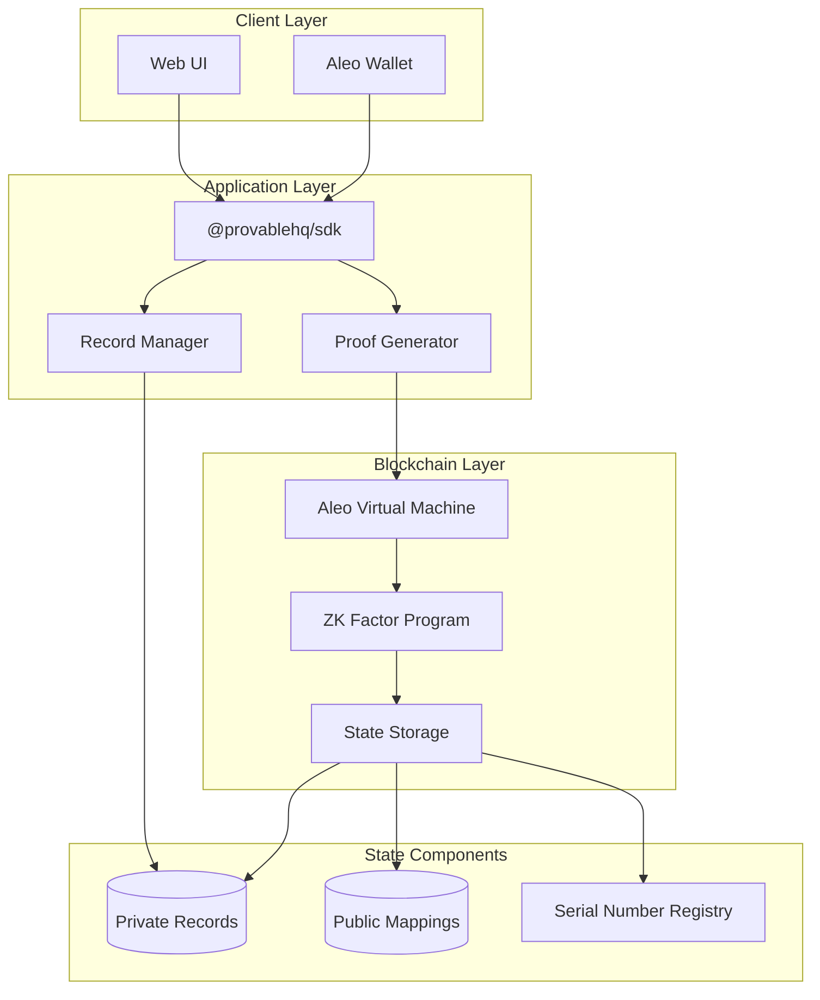
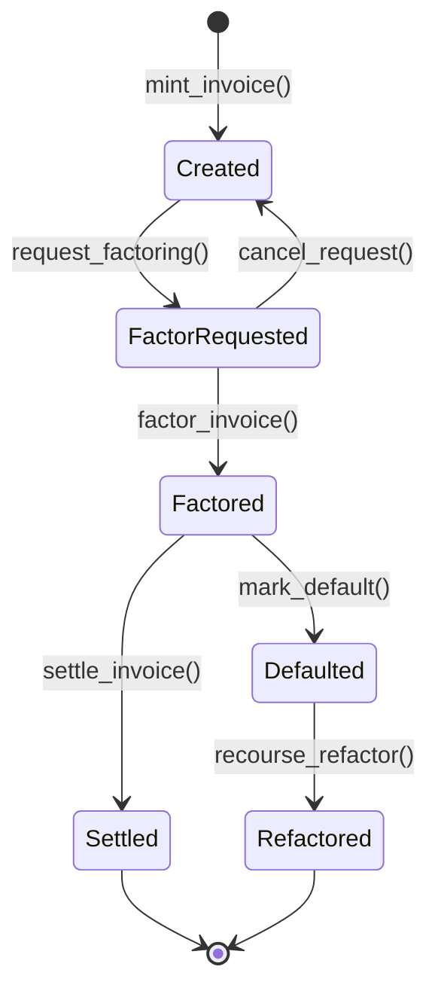
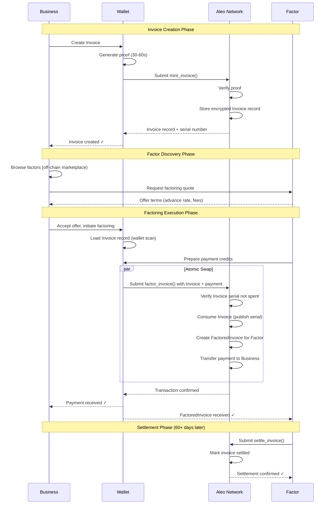
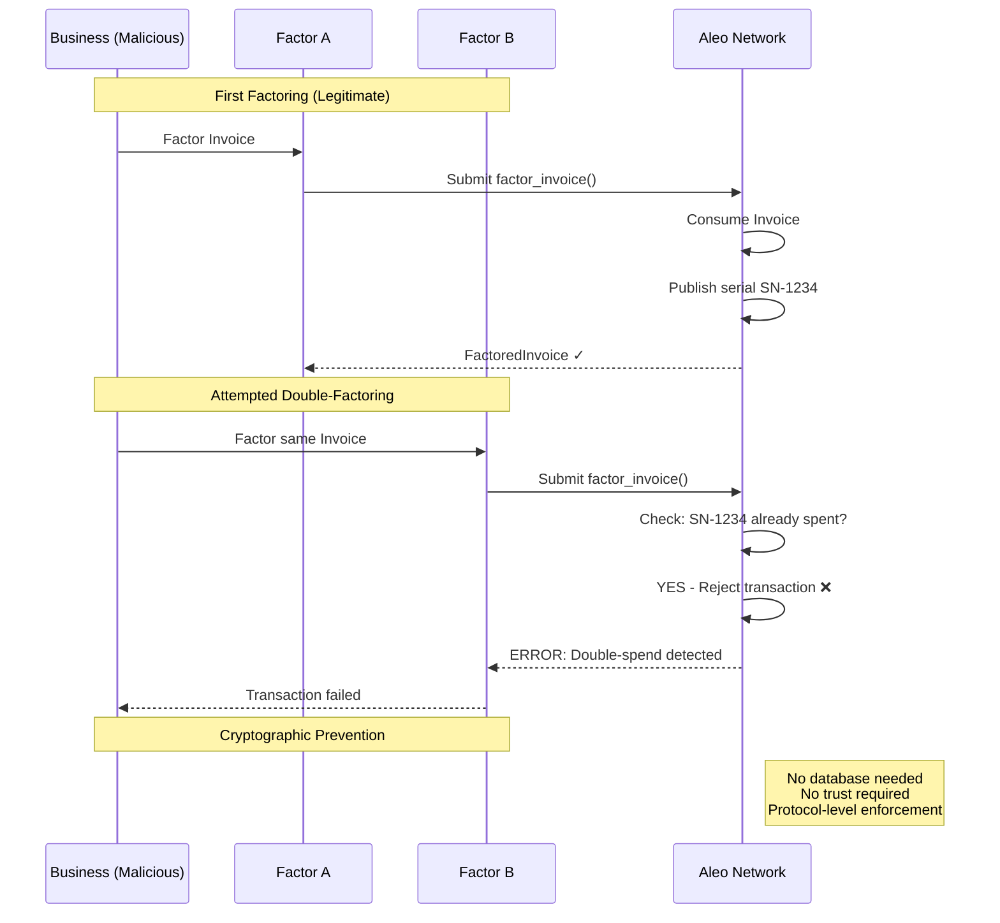
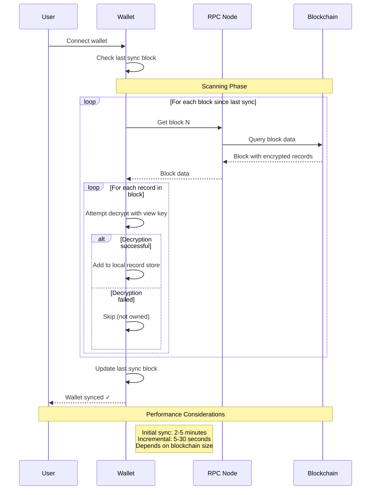
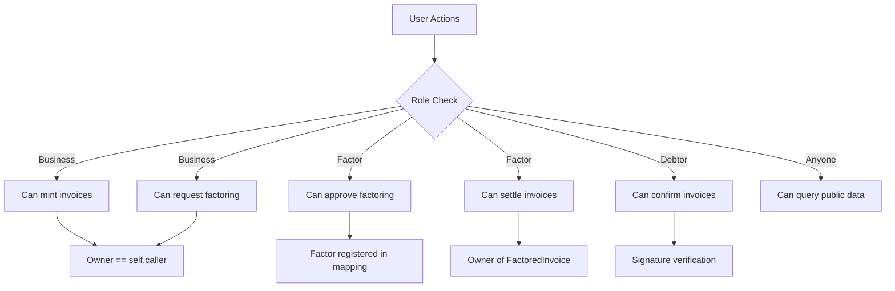
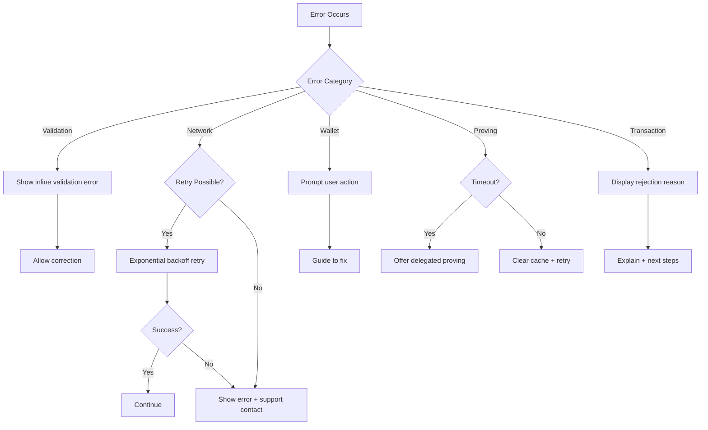
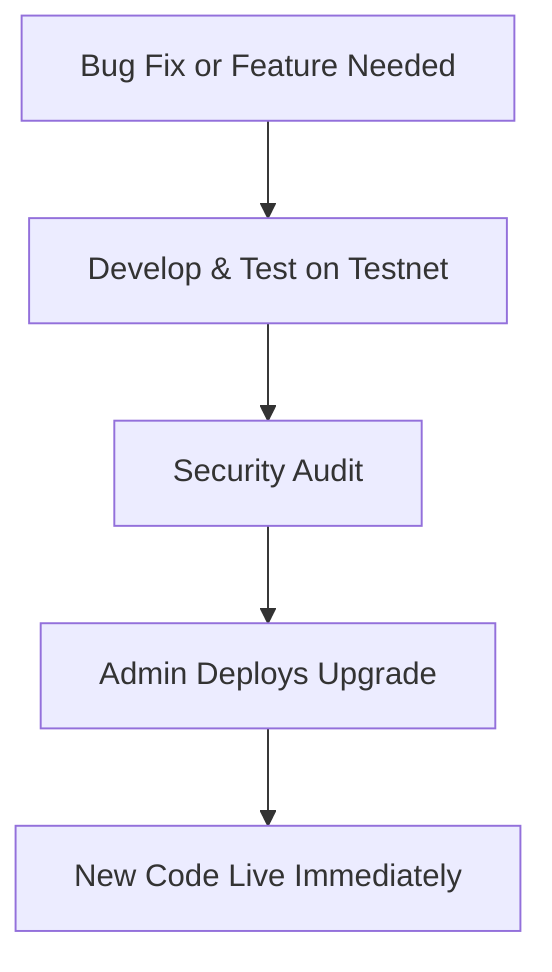

## Table of Contents

- [System Overview](#system-overview)
- [Data Models](#data-models)
- [Program Transitions](#program-transitions)
- [System Sequences](#system-sequences)
- [Privacy Architecture](#privacy-architecture)
- [API Specifications](#api-specifications)
- [Security Specifications](#security-specifications)
- [Error Handling](#error-handling)
- [Testing Specifications](#testing-specifications)
- [Maintenance & Operations](#maintenance--operations)
- [Constraints & Limitations](#constraints--limitations)
- [Appendices](#appendices)

## System Overview

### Purpose

ZK Factor is a privacy-preserving invoice factoring platform built on Aleo blockchain that cryptographically prevents double-factoring fraud while maintaining confidentiality of business relationships, invoice amounts, and transaction details.

### System Architecture



### Technology Stack

| Layer          | Technology                 |
| -------------- | -------------------------- |
| Blockchain     | Aleo Mainnet               |
| Smart Contract | Leo                        |
| SDK            | @provablehq/sdk            |
| Frontend       | React + TypeScript         |
| Wallet         | Leo Wallet / Puzzle Wallet |
| Proving        | WASM-based (browser)       |

## Data Models

### Record Structures

#### Invoice Record

```leo
record Invoice {
    owner: address,              // Business that created invoice
    debtor: address,             // Customer who owes payment
    amount: u64,                 // Amount in microcredits (1M = 1 ALEO)
    due_date: u64,              // Unix timestamp (seconds)
    invoice_hash: field,         // Poseidon hash of invoice details
    nonce: field,               // Unique identifier
    metadata: u128              // Packed metadata (invoice #, type, flags)
}
```

**Field Specifications:**

- `amount`: Range 1 to 18,446,744,073,709,551,615 microcredits
- `due_date`: Must be > current block timestamp
- `invoice_hash`: Poseidon hash of off-chain invoice document
- `nonce`: Generated from invoice number + timestamp + random salt
- `metadata`: Bit-packed structure:
    - Bits 0-31: Invoice number
    - Bits 32-47: Invoice type flags
    - Bits 48-127: Reserved

#### FactoredInvoice Record

```leo
record FactoredInvoice {
    owner: address,              // Factor who purchased invoice
    original_creditor: address,  // Business that created invoice
    debtor: address,             // Customer who owes payment
    amount: u64,                 // Original invoice amount
    advance_amount: u64,         // Amount paid to business (< amount)
    due_date: u64,              // Original due date
    factoring_date: u64,        // When factoring occurred
    advance_rate: u16,          // Basis points (e.g., 9500 = 95%)
    invoice_hash: field,        // Links to original invoice
    recourse: bool              // True if recourse factoring
}
```

**Field Specifications:**

- `advance_amount`: Must be < `amount`
- `advance_rate`: Range 5000-9900 (50%-99%)
- `recourse`: Determines if business must repurchase on debtor default
- All address fields must be valid Aleo addresses

### Public Mappings

```leo
// Track registered factoring companies
mapping active_factors: address => FactorInfo;

struct FactorInfo {
    is_active: bool,
    min_advance_rate: u16,
    max_advance_rate: u16,
    total_factored: u64,
    registration_date: u64
}

// Track settlement status (prevents double settlement)
mapping settled_invoices: field => SettlementInfo;

struct SettlementInfo {
    is_settled: bool,
    settlement_date: u64,
    factor: address
}

// Protocol statistics (public analytics)
mapping protocol_stats: u8 => u64;
// Keys: 0=total_invoices, 1=total_factored, 2=total_settled, 3=total_volume
```

---

## Program Transitions

### Invoice Lifecycle State Machine



### Transition Specifications

#### mint_invoice

**Signature:**

```leo
transition mint_invoice(
    debtor: address,
    amount: u64,
    due_date: u64,
    invoice_hash: field,
    metadata: u128
) -> Invoice
```

**Preconditions:**

- `amount > 0`
- `due_date > block.timestamp`
- `debtor != self.caller`

**Postconditions:**

- Returns new Invoice record owned by caller
- No state mappings modified
- Serial number not yet published

**Constraints:**

- Circuit complexity: ~50k constraints
- Expected proving time: 30-40 seconds

**Validation Logic:**

```
assert(amount > 0u64);
assert(due_date > block.timestamp);
assert(debtor != self.caller);

// Generate unique nonce
let nonce: field = Poseidon2::hash_to_field(
    invoice_hash, 
    block.timestamp, 
    self.caller
);

// Create invoice record
return Invoice {
    owner: self.caller,
    debtor: debtor,
    amount: amount,
    due_date: due_date,
    invoice_hash: invoice_hash,
    nonce: nonce,
    metadata: metadata
};
```

#### factor_invoice

**Signature:**

```leo
transition factor_invoice(
    invoice: Invoice,
    factor: address,
    advance_rate: u16,
    payment: credits.aleo/credits
) -> (FactoredInvoice, credits.aleo/credits)
```

**Preconditions:**

- `invoice.owner == self.caller`
- `factor` is registered in `active_factors` mapping
- `advance_rate` within factor's accepted range
- `payment.amount >= (invoice.amount * advance_rate) / 10000`
- Invoice serial number not in spent registry

**Postconditions:**

- Invoice record consumed (serial number published)
- FactoredInvoice record created, owned by factor
- Payment credits transferred to business
- Protocol stats updated

**Atomic Swap Guarantee:** All three operations (consume invoice, create factored invoice, transfer payment) succeed or all fail. No partial execution possible.

**Implementation Pattern:**

```leo
transition factor_invoice(
    invoice: Invoice,
    factor: address,
    advance_rate: u16,
    payment: credits.aleo/credits
) -> (FactoredInvoice, credits.aleo/credits) {
    
    // Validate advance rate
    assert(advance_rate >= 5000u16 && advance_rate <= 9900u16);
    
    // Calculate advance amount
    let advance_amount: u64 = (invoice.amount * (advance_rate as u64)) / 10000u64;
    assert(payment.amount >= advance_amount);
    
    // Create factored invoice for factor
    let factored: FactoredInvoice = FactoredInvoice {
        owner: factor,
        original_creditor: self.caller,
        debtor: invoice.debtor,
        amount: invoice.amount,
        advance_amount: advance_amount,
        due_date: invoice.due_date,
        factoring_date: block.timestamp,
        advance_rate: advance_rate,
        invoice_hash: invoice.invoice_hash,
        recourse: false
    };
    
    // Return payment to business
    let business_payment: credits.aleo/credits = credits.aleo/transfer_private(
        payment,
        self.caller,
        advance_amount
    );
    
    // Update protocol stats
    return then finalize(invoice.invoice_hash);
    
    return (factored, business_payment);
}

finalize factor_invoice(invoice_hash: field) {
    // Increment total factored counter
    let current: u64 = protocol_stats.get_or_use(1u8, 0u64);
    protocol_stats.set(1u8, current + 1u64);
}
```

#### settle_invoice

**Signature:**

```leo
transition settle_invoice(
    factored: FactoredInvoice,
    payment: credits.aleo/credits
) -> credits.aleo/credits
```

**Preconditions:**

- `factored.owner == self.caller` (factor owns the record)
- `payment.amount >= factored.amount` (full invoice payment)
- Invoice not already marked as settled
- Current timestamp >= `factored.due_date` (optional check)

**Postconditions:**

- FactoredInvoice record consumed
- Settlement marked in `settled_invoices` mapping
- Payment released to factor
- Protocol stats updated

**Double Settlement Prevention:** The finalize block checks `settled_invoices` mapping before allowing settlement.

---

## System Sequences

### Primary Factoring Flow



### Double-Factoring Prevention Flow



### Record Discovery Flow



---

## Privacy Architecture

### Privacy Guarantees

|Data Element|Visibility|Mechanism|
|---|---|---|
|Invoice amount|Business + Factor only|Record encryption (owner key)|
|Debtor identity|Business + Factor only|Record encryption|
|Factoring terms|Business + Factor only|Record encryption|
|Goods/services|Business only|Off-chain storage, hash only|
|Business identity|Obfuscated|Pseudonymous addresses|
|Serial numbers|Public|Required for double-spend prevention|
|Function calls|Public|Aleo limitation (no function privacy)|
|Transaction timing|Public|Blockchain consensus requirement|

## API Specifications

### SDK Integration Layer

```typescript
interface ZKFactorSDK {
    // Invoice Management
    createInvoice(params: CreateInvoiceParams): Promise<InvoiceRecord>;
    getInvoices(owner: string): Promise<InvoiceRecord[]>;
    
    // Factoring Operations
    requestFactoring(invoice: InvoiceRecord, factor: string): Promise<FactoringRequest>;
    executeFactoring(request: FactoringRequest): Promise<FactoredInvoiceRecord>;
    settleInvoice(factored: FactoredInvoiceRecord, payment: Payment): Promise<Transaction>;
    
    // Verification
    verifyInvoiceUnspent(serialNumber: string): Promise<boolean>;
    checkFactorRegistration(address: string): Promise<FactorInfo>;
    
    // Record Discovery
    syncWallet(progressCallback?: (percent: number) => void): Promise<void>;
}

interface CreateInvoiceParams {
    debtor: string;          // Aleo address
    amount: bigint;          // Microcredits
    dueDate: number;         // Unix timestamp
    invoiceDetails: {        // Off-chain data
        invoiceNumber: string;
        description: string;
        items: InvoiceItem[];
    };
}

interface InvoiceRecord {
    owner: string;
    debtor: string;
    amount: bigint;
    dueDate: number;
    invoiceHash: string;
    nonce: string;
    serialNumber: string;   // Computed from record
}

interface FactoredInvoiceRecord extends InvoiceRecord {
    factor: string;
    advanceRate: number;    // Basis points
    factoringDate: number;
    recourse: boolean;
}
```

### RPC Endpoints

**Application-Specific Services:**

```
POST /api/v1/factors/register
GET /api/v1/factors/list
GET /api/v1/marketplace/offers
POST /api/v1/analytics/stats
```

## Security Specifications

### Smart Contract Security

**Critical Assertions:**

```leo
// Amount validation
assert(amount > 0u64);
assert(amount <= MAX_INVOICE_AMOUNT);

// Date validation  
assert(due_date > block.timestamp);
assert(due_date <= block.timestamp + MAX_DUE_DATE_OFFSET);

// Address validation
assert(debtor != self.caller);
assert(factor != debtor);

// Rate validation
assert(advance_rate >= MIN_ADVANCE_RATE);
assert(advance_rate <= MAX_ADVANCE_RATE);

// Payment validation
assert(payment.amount >= advance_amount);
```

**Reentrancy Prevention:** Aleo's execution model prevents reentrancy by design -- each transition is atomic and finalized before the next can begin.

**Integer Overflow Protection:**

```leo
// Safe multiplication with overflow check
let product: u128 = (amount as u128) * (advance_rate as u128);
assert(product <= (u64::MAX as u128));
let advance_amount: u64 = (product / 10000u128) as u64;
```

### Access Control



**Role-Based Permissions:**

```leo
// Only invoice owner can factor it
assert(invoice.owner == self.caller);

// Only registered factors can receive factored invoices
assert(active_factors.contains(factor));

// Only factored invoice owner can settle
assert(factored.owner == self.caller);
```

### Audit Trail

**On-Chain Audit Points:**

- Invoice minting (serial number published)
- Factoring execution (serial number consumed)
- Settlement completion (mapping update)

**Off-Chain Audit Recommendations:**

- Log all transaction IDs with timestamps
- Store encrypted invoice details with cryptographic proofs
- Maintain debtor acknowledgment signatures
- Record factor approval decisions with justifications

## Error Handling

### Error Categories

```typescript
enum ErrorCategory {
    VALIDATION_ERROR = "VALIDATION",
    NETWORK_ERROR = "NETWORK",
    WALLET_ERROR = "WALLET",
    PROVING_ERROR = "PROVING",
    TRANSACTION_ERROR = "TRANSACTION"
}

interface ZKFactorError {
    category: ErrorCategory;
    code: string;
    message: string;
    details?: object;
    recoverable: boolean;
}
```

### Common Error Scenarios

|Error Code|Description|Recovery Action|
|---|---|---|
|VAL_001|Amount exceeds maximum|Reject with error message|
|VAL_002|Due date in past|Request correction|
|VAL_003|Invalid advance rate|Show valid range|
|NET_001|RPC timeout|Retry with exponential backoff|
|NET_002|Transaction rejected|Display rejection reason|
|WAL_001|Wallet not connected|Prompt wallet connection|
|WAL_002|Insufficient funds|Show required amount|
|WAL_003|Record not found|Trigger wallet sync|
|PRV_001|Proving timeout|Suggest delegated proving|
|PRV_002|Key synthesis failed|Retry or clear cache|
|TXN_001|Double-spend detected|Inform invoice already factored|
|TXN_002|Serial number spent|Block duplicate factoring|

### Error Handling Flow



---

## Testing Specifications

### Unit Test Coverage

**Leo Program Tests:**

```bash
# Test invoice creation
leo run mint_invoice \
  "aleo1..." \
  1000000u64 \
  1738368000u64 \
  123456field \
  0u128

# Test factoring with valid inputs
leo run factor_invoice \
  "{invoice_record}" \
  "aleo1..." \
  9500u16 \
  "{credits_record}"

# Test double-spend prevention
leo run factor_invoice \
  "{spent_invoice}" \
  "aleo1..." \
  9500u16 \
  "{credits_record}"
# Expected: Transaction failure
```

**Test Cases:**

- ✅ Valid invoice creation
- ✅ Invalid amount (zero, negative)
- ✅ Invalid due date (past, too far future)
- ✅ Valid factoring execution
- ✅ Double-factoring attempt (should fail)
- ✅ Invalid advance rate (too low, too high)
- ✅ Insufficient payment
- ✅ Valid settlement
- ✅ Double settlement attempt (should fail)

### Integration Tests

**Scenario 1: Happy Path**

1. Business creates invoice
2. Factor approves factoring
3. Factoring executes atomically
4. Debtor pays factor
5. Factor settles invoice

**Scenario 2: Double-Factoring Prevention**

1. Business creates invoice
2. Business factors with Factor A (succeeds)
3. Business attempts to factor same invoice with Factor B
4. Verify: Transaction fails with double-spend error

**Scenario 3: Recourse Handling**

1. Business creates invoice with recourse flag
2. Factor purchases invoice
3. Debtor defaults
4. Factor initiates recourse
5. Business receives FactoredInvoice back

## Maintenance & Operations

### Upgrade Procedures

**Smart Contract Upgrades:** ZK-Factor program is upgradable through an admin-controlled constructor.

**Governance Model (MVP):**

The program is deployed with a simple admin-based constructor:

- **Admin Address:** Single address authorized to deploy upgrades
- **Upgrade Process:** Admin deploys new program version, no timelock required
- **Transparency:** Upgrade history tracked via `protocol_stats` mapping

**What Can Be Upgraded:**

Allowed modifications:
- Function/transition logic (signatures unchanged)
- Gas optimizations and fee calculations
- Add new transitions, mappings, structs, record types
- Protocol statistics tracking improvements
- Internal business logic improvements

Cannot be modified (Aleo platform constraints):
- Existing record structures (breaks compatibility with existing records)
- Transition signatures (breaks compatibility with dependent programs)
- Existing mapping key/value types (would lose existing data)
- The constructor itself (immutable once deployed)

**Critical Constraint:** Constructor logic is immutable once deployed. The constructor must be minimal and well-tested before deployment. Any bugs in the constructor require deploying an entirely new program.

**Upgrade Flow:**



**Future Enhancements:**

The admin governance can be upgraded to add:
- Multi-signature requirements (2-of-3 or 3-of-5)
- Timelock delays (e.g., 7-day waiting period)
- Community voting mechanisms
- Permanent ossification (disable future upgrades)

These can be added later without redeploying the entire program.

**Migration Strategy:**
1. Deploy `zk_factor_v2.aleo` with migration transitions
2. Users opt-in to migrate records (gas cost per record)
3. V1 program continues operating indefinitely
4. Factors support both programs during transition

### Backup & Recovery

**What to Backup:**

- User wallet private keys (user responsibility)
- Off-chain invoice documents and metadata
- Application configuration
- Analytics data

**Recovery Procedures:**

- On-chain data is permanently stored on blockchain (no backup needed)
- Wallet recovery from seed phrase
- Record re-discovery through blockchain scan
- Transaction history reconstruction from blockchain

### Operational Runbook

**Daily Operations:**

- Monitor transaction success rates
- Check RPC endpoint health
- Review error logs
- Update protocol metrics dashboard

**Weekly Operations:**

- Analyze usage trends
- Review security alerts
- Update documentation
- Test backup/recovery procedures

**Incident Response:**

1. Detect: Automated alerting + monitoring
2. Assess: Determine severity and impact
3. Communicate: Notify affected users
4. Mitigate: Apply immediate fixes
5. Resolve: Implement permanent solution
6. Postmortem: Document lessons learned

## Constraints & Limitations

### Aleo Platform Constraints

|Constraint|Value|Impact|
|---|---|---|
|Max transaction size|128 KB|Limits complex multi-record operations|
|Circuit constraints|~2M per transition|Caps computational complexity|
|Max records per program|310|Sufficient for use case|
|Proving time|30-420 sec|UX friction, requires async design|
|Record discovery|Full blockchain scan|Slow initial wallet sync|
|Function privacy|Not implemented|Function calls are public|
|No SHA-2/RSA/ECDSA|Native limitation|Limits external integration|

### MVP Limitations

**Phase 1 Scope Exclusions:**

- ❌ Partial factoring (split ownership)
- ❌ Multi-factor syndication
- ❌ Automated settlement triggers
- ❌ Credit scoring system
- ❌ Cross-border currency support
- ❌ Debtor auto-notification
- ❌ Real-time price discovery

**Known Issues:**

- Wallet sync can take 2-5 minutes for new users
- Proving times may frustrate users expecting instant feedback
- No offline proof generation capability
- Limited to browser-based execution (no mobile native)

## Appendices

### Glossary

|Term|Definition|
|---|---|
|Factor|Financial institution that purchases invoices at discount|
|Advance Rate|Percentage of invoice value paid upfront (e.g., 95%)|
|Recourse|Agreement where business repurchases invoice if debtor defaults|
|Serial Number|Cryptographic commitment to record, published when spent|
|Transition|State-changing function in Leo program|
|Microcredits|Smallest unit of ALEO token (1M microcredits = 1 ALEO)|
|View Key|Private key enabling read-only access to encrypted records|
|zkSNARK|Zero-Knowledge Succinct Non-Interactive Argument of Knowledge|
